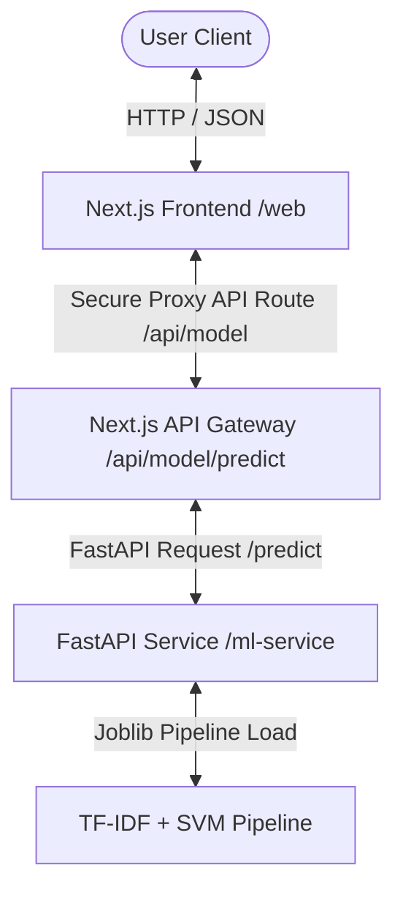

# 📧 AI-Powered Email Spam Detection System
An end-to-end, production-grade machine learning system designed to classify email messages as either **Spam** or **Ham** (Legitimate). The project comprises a Jupyter Notebook for model training, a Python FastAPI microservice for real-time predictions, and a premium, modern Next.js frontend with stunning ambient animations.
---
## 🏗️ System Architecture
This project is built using a modern decoupled microservices architecture. Below is a diagram illustrating how the client interacts with the machine learning pipeline:

---
## ✨ Features
- **🎯 Production-Grade Accuracy**: Real-time classifications powered by a high-accuracy Support Vector Classifier (SVC) model.
- **✨ Gorgeous Next.js UI**: Implements modern design systems with smooth ambient glow backdrops, glassmorphism, responsive grid overlays, interactive text areas, and dynamic Framer Motion animations.
- **⚡ Safe API Gateway Pattern**: Prevents exposure of machine learning endpoints by proxying frontend requests through server-side Next.js route handlers.
- **🩺 Active Health Monitoring**: Integrates a robust backend checker allowing users to verify model loading status and FastAPI microservice health status straight from the navigation bar.
- **📊 Interactive Metrics Dialog**: Clear representation of classification confidence, labels, and system statistics.
---
## 📊 Machine Learning Model Details
The machine learning workflow is researched and developed inside `ML_1_2_Project.ipynb`.
### 1. Data Source & Preprocessing
The model is trained on a combined corpus formed from two primary datasets:
- **`email.csv`**: Basic spam-classification CSV containing `Message` and `Category`.
- **`emails.csv`**: Raw dataset containing a `text` column with standard `Subject:` headers.
  
**Preprocessing Pipeline:**
- Columns normalized to standard names (`text` and `spam`).
- Subject tags removed from the second dataset via regular expressions (`r"^Subject:\s*"`).
- NaNs and duplicates removed, leaving a unified dataset saved as `final_emails.csv`.
### 2. Feature Extraction
Text strings are tokenized and processed using `TfidfVectorizer` (Term Frequency-Inverse Document Frequency):
- **Stop Words**: Ignored using standard English vocabulary.
- **Maximum Features**: Capped at `5,000` to prevent overfitting and optimize inference speed.
### 3. Model Comparison & Metrics
Three classifier architectures were thoroughly tested using an `80/20` train-test split:
|
 Model Architecture 
|
 Test Accuracy 
|
 Ham F1-Score 
|
 Spam F1-Score 
|
 Precision (Spam) 
|
 Recall (Spam) 
|
|
:---
|
:---:
|
:---:
|
:---:
|
:---:
|
:---:
|
|
**
Logistic Regression (LR)
**
|
 95.62% 
|
 0.97 
|
 0.88 
|
 0.97 
|
 0.81 
|
|
**
Multinomial Naive Bayes (MNB)
**
|
 96.82% 
|
 0.98 
|
 0.92 
|
 0.97 
|
 0.87 
|
|
**
Support Vector Classifier (SVC)
**
|
**
97.24%
**
|
**
0.98
**
|
**
0.93
**
|
**
0.98
**
|
**
0.88
**
|
### 4. Serialization
Since **Support Vector Classifier (SVC)** yielded the highest accuracy ($97.24\%$) and best overall precision for identifying spam ($98\%$), it was chosen for production. An end-to-end `Pipeline` encapsulating the fitted `TfidfVectorizer` and `SVC` classifier was saved as `spam_predictor_model.joblib`.
---
## 📂 Project Directory Structure
```text
ML_2_Email_Spam_Detection/
├── ML_1_2_Project.ipynb        # Jupyter Notebook with exploratory data analysis & training
├── email.csv                   # Raw training dataset A
├── emails.csv                  # Raw training dataset B
├── deploy.sh                   # Bash production deployment script
├── ml-service/                 # FastAPI Python Microservice
│   ├── app.py                  # API endpoints, middleware, & model loading
│   ├── requirements.txt        # Python package dependencies
│   └── models/
│       └── spam_predictor_model.joblib # Serialized Pipeline model
└── web/                        # Next.js Frontend App
    ├── app/                    # Next.js Pages & Client-facing proxy routes
    │   ├── api/model/predict/  # API route handling secure POST requests
    │   ├── page.tsx            # Main client interface
    │   └── globals.css         # Styling system & custom dark theme
    ├── components/             # Reusable UI Components (Navbar, StatBars, Forms)
    └── package.json            # Node.js dependencies & scripts
```
---
## 🚀 Setup & Installation
Follow these steps to run the complete stack locally:
### Prerequisites
- Python `3.9` or higher
- Node.js `18.x` or higher
- npm or yarn
---
### Step 1: Set Up & Run the FastAPI Backend
1. Navigate to the `ml-service` directory:
   ```bash
   cd ml-service
   ```
2. Create and activate a python virtual environment:
   ```bash
   # On Windows
   python -m venv venv
   .\venv\Scripts\activate
   # On macOS/Linux
   python3 -m venv venv
   source venv/bin/activate
   ```
3. Install dependencies:
   ```bash
   pip install -r requirements.txt
   ```
4. Verify that your trained model (`spam_predictor_model.joblib`) is placed under the `ml-service/models/` directory.
5. Run the development server (configured using Uvicorn):
   ```bash
   # Run app.py using uvicorn directly
   uvicorn app:app --host 127.0.0.1 --port 5000 --reload
   ```
   *The API will be available at `http://127.0.0.1:5000`.*
---
### Step 2: Set Up & Run the Next.js Frontend
1. Navigate to the `web` directory:
   ```bash
   cd ../web
   ```
2. Install Node packages:
   ```bash
   npm install
   ```
3. Configure Environment Variables. Create a `.env.local` file in the root of the `web` folder:
   ```env
   NEXT_PRIVATE_ML_SERVICE_URL=http://127.0.0.1:5000
   ```
4. Spin up the dev server:
   ```bash
   npm run dev
   ```
   *The client interface will boot up at `http://localhost:3000`.*
---
## 🔌 API Documentation (FastAPI Microservice)
### 🩺 Health Check
- **Endpoint**: `/health`
- **Method**: `GET`
- **Response**:
  ```json
  {
    "status": "ok",
    "model_loaded": true
  }
  ```
### 🔮 Make Prediction
- **Endpoint**: `/predict`
- **Method**: `POST`
- **Request Body**:
  ```json
  {
    "text": "Congratulations! You have won a free $1,000 Walmart gift card. Click here to claim your reward now!"
  }
  ```
- **Response**:
  ```json
  {
    "input": "Congratulations! You have won a free $1,000 Walmart gift card. Click here to claim your reward now!",
    "prediction": 1,
    "label": "spam"
  }
  ```
---
## 🚢 Deployment (Production)
For standard production deployment, a unified deployment script `deploy.sh` is provided. This script handles repository pull, dependency installation, bundling, and starting the Next.js client with `PM2` node manager:
```bash
# Set execute permissions (Mac/Linux)
chmod +x deploy.sh
# Run the deployment
./deploy.sh
```
---
## 🛡️ License
This project is open-source and available under the [MIT License](LICENSE).
